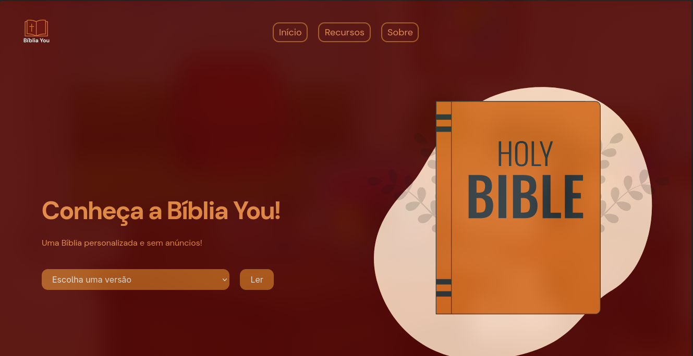
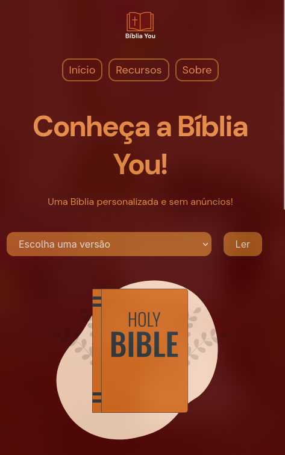

# ✨ Bíblia You

<p align="center">
  <b>Uma nova forma de ler a Bíblia — simples, moderna e sem anúncios.</b>
</p>

<p align="center">
  
  
  
  
</p>

---

## 📖 Sobre

O **Bíblia You** é um projeto criado com o objetivo de oferecer uma experiência moderna e fluida de leitura da Bíblia, tanto no navegador quanto em dispositivos móveis.

A proposta é simples:  
**Remover distrações e focar no que realmente importa — a Palavra.**

---

## 🚀 Destaques

- ⚡ Leve, rápido e direto ao ponto  
- 📱 Disponível como **Site e APK**  
- 🎯 Interface limpa e agradável  
- 📚 Múltiplas versões da Bíblia  
- 💡 Pensado para evolução contínua  

---

## 📚 Versões disponíveis

- 📖 Almeida Revisada Impressa Bíblica (**AA**)  
- 📖 Almeida Corrigida Fiel (**ACF**)  
- 📖 Nova Versão Internacional (**NVI**)  

---

## 🖥️ Acesse

<p align="center">
  <a href="https://zaquea.github.io/Bible/"><b>🌐 Ver site</b></a> •
  <a href="https://github.com/zaquea/Bible/releases"><b>📲 Baixar APK</b></a>
</p>

---

## 🛠️ Tecnologias

```bash
HTML • CSS • JavaScript
````

---

## 📸 Preview

**💻 Desktop**
<p align="center">  </p>

**📱 Mobile**
<p align="center">  </p>

---

## ⚙️ Como rodar

```bash
# Clone o projeto
git clone https://github.com/zaquea/Bible.git

# Entre na pasta
cd Bible

# Abra no navegador
index.html
```

---

## 📦 Créditos

Os dados das Escrituras foram obtidos a partir de:

<a href="https://github.com/thiagobodruk/biblia">Repositório dos JSON</a>

---

## 👨‍💻 Autor

<p align="center">
  Feito com dedicação por <b>Zaque</b> ✨
</p>

---

## 🔮 Futuro do projeto

O Bíblia You ainda está evoluindo. Algumas ideias futuras:

* 🌙 Modo escuro
* 🔎 Busca inteligente de versículos
* ❤️ Sistema de favoritos
* 📅 Versículo do dia
* 🔔 Notificações no app

---

## ⭐ Apoie

Se esse projeto te ajudou ou te inspirou:

<p align="center">
  <a href="https://github.com/zaquea/Bible/stargazers">
    
  </a>
  <a href="https://github.com/zaquea/Bible/network/members">
    
  </a>
  <a href="https://twitter.com/intent/tweet?text=Veja%20esse%20projeto%20B%C3%ADblia%20You!&url=https://github.com/zaquea/Bible">
    
  </a>
</p>

---

<p align="center">
  <b>"Lâmpada para os meus pés é a tua palavra..."</b> ✨
</p>
```
